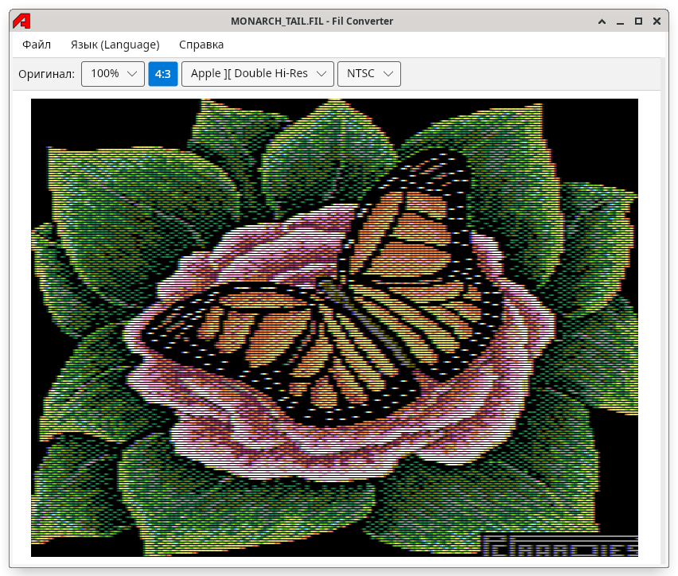

# <span style="float:left;margin-right:8pt"></span>Fil Converter

## Содержание

- [Введение](#intro)
- [Форматы](#formats)
- [Функции](#features)
- [Недоделки](#bugs)
- [Лицензия](#license)
            
<a id="intro"></a>
## Введение
                       
**Fil Converter** -- это программа для просмотра и преобразования графики для ретро-компьютеров.



<a id="formats"></a>                  
## Форматы

За редкими исключениями, картинки хранятся в [FIL-контейнерах][1] утилиты [dos33c2][2].
Графика хранится в формате дампа памяти соответствующего графического режима,
а значит, сравнительно легко может быть выведена на экран в эмуляторе или на реальном железе.

На данный момент поддерживаются следующие форматы:
 
| Формат                 | Тип файла | Запись | Разрешение | Кол-во цветов               | Комментарий                 |
|------------------------|-----------|--------|------------|-----------------------------|-----------------------------|
| Агат-7 ЦГНР            | FIL       | +      | 64 x 64    | 16                          |                             |
| Агат ЦГCР              | FIL       | +      | 128 x 128  | 16                          |                             |
| Агат МГВР              | FIL       | +      | 256 x 256  | 2                           |                             |
| Агат-9 ЦГВР            | FIL       | +      | 256 x 256  | 4                           |                             |
| Агат-9 МГДП            | FIL       | +      | 512 x 256  | 2                           |                             |
| Агат-9 Apple           | FIL       |        | 280 x 192  | 6, RGB палитра              | Без заливки колонок         |
| 128x256x16             | FIL       | +      | 128 x 256  | 16                          |                             |
| Apple ][ Lo-Res        | FIL       | ±      | 40 x 24    | 16                          |                             |
| Apple ][ Double Lo-Res | FIL       | ±      | 40 x 48    | 16                          |                             |
| Apple ][ Hi-Res        | FIL       | ±      | 280 x 192  | 6, оранжево-голубая палитра | C заливкой                  |
| Apple ][ Double Hi-Res | FIL       | ±      | 140 x 192  | 16                          |                             |
| Spectrum               | SCR       |        | 256 x 192  | 16, без поддержки мигания   | Порядок строк как на железе |
| Spectrum               | BOL       |        | 256 x 192  | 16, без поддержки мигания   | Строки сверху вниз          |                             |
| Windows Bitmap         | BMP       | +      |            |                             |                             |
| JPEG                   | JPG, JPEG | +      |            |                             |                             |
| PNG                    | PNG       | +      |            |                             |                             |
| GIF                    | GIF       | +      |            |                             |                             |
| TIFF                   | TIF, TIFF | +      |            |                             |                             |
                    
<a id="features"></a>
## Функции

Для агатовских режимов поддерживается режим карты палитр, как для отображения, так и при генерации.
  
Для FIL-контейнеров поддерживается ["хвост"][3] -- 252 байта с дополнительной информацией об изображении.
            
<a id="bugs"></a>
## Недоделки

Поддержка "хвоста" пока неполная:

- Нет возможности просматривать и тем более редактировать комментарий
- При перезаписи файла старый хвост теряется и заменяется на новый

При конвертации в режим карты палитр палитра формируется только автоматически. Задавать таблицу цветов нельзя.

<a id="license"></a>
## Лицензия

Исходные коды Fil Converter могут быть использованы на условиях лицензии MIT:
                  
```
Copyright 2011 Sergey "SnakE" Gromov

Permission is hereby granted, free of charge, to any person obtaining
a copy of this software and associated documentation files (the "Software"),
to deal in the Software without restriction, including without limitation
the rights to use, copy, modify, merge, publish, distribute, sublicense,
and/or sell copies of the Software, and to permit persons to whom
the Software is furnished to do so, subject to the following conditions:

The above copyright notice and this permission notice shall be included
in all copies or substantial portions of the Software.

THE SOFTWARE IS PROVIDED "AS IS", WITHOUT WARRANTY OF ANY KIND, EXPRESS
OR IMPLIED, INCLUDING BUT NOT LIMITED TO THE WARRANTIES OF MERCHANTABILITY,
FITNESS FOR A PARTICULAR PURPOSE AND NONINFRINGEMENT. IN NO EVENT SHALL
THE AUTHORS OR COPYRIGHT HOLDERS BE LIABLE FOR ANY CLAIM, DAMAGES OR OTHER
LIABILITY, WHETHER IN AN ACTION OF CONTRACT, TORT OR OTHERWISE, ARISING FROM,
OUT OF OR IN CONNECTION WITH THE SOFTWARE OR THE USE OR OTHER DEALINGS
IN THE SOFTWARE.
```

[1]: http://agatcomp.ru/agat/PCutils/FileType/FIL.shtml
[2]: http://agatcomp.ru/agat/PCutils/dos33.shtml
[3]: http://agatcomp.ru/agat/PCutils/EXIF.shtml
